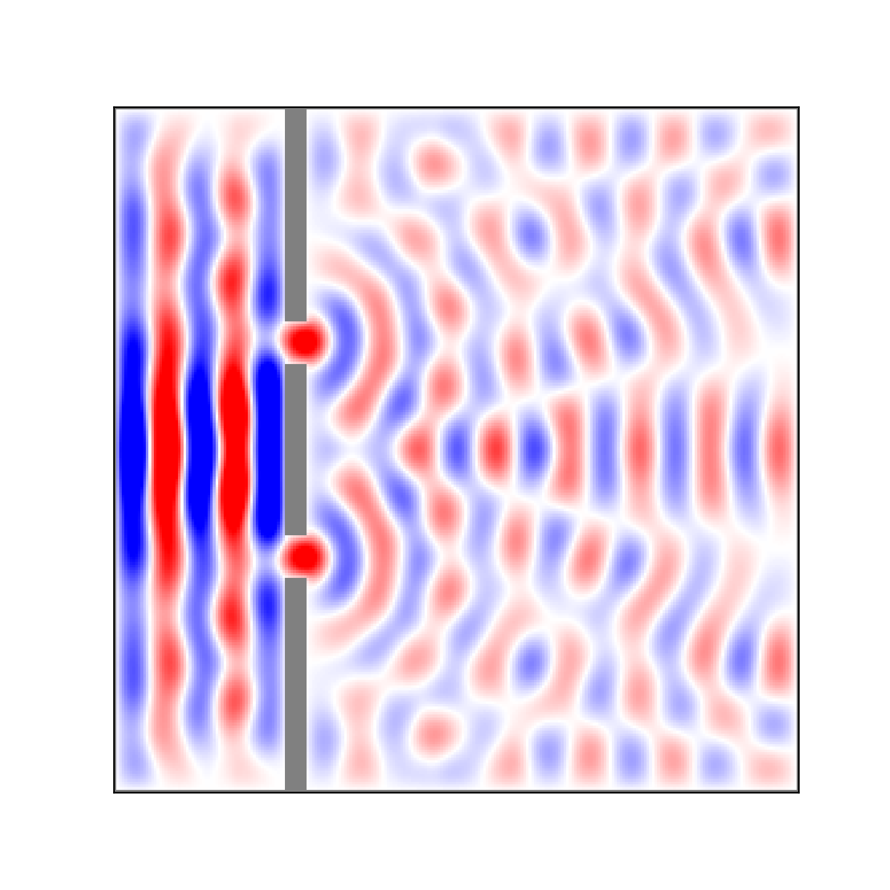

# finitedifference-python
Finite Difference simulation of the Wave Equation (Double-slit experiment)

## Create Your Own Finite Difference Wave Equation Simulation (With Python)

### Philip Mocz (2023) [@PMocz](https://twitter.com/PMocz)

### [📝 Read the Algorithm Write-up on Medium](https://philip-mocz.medium.com/create-your-own-finite-difference-wave-equation-simulation-with-python-3971617f825e)

Simulate the double-slit experiment (with Wave Equations) using Finite Difference


```
python finitedifference.py
```


